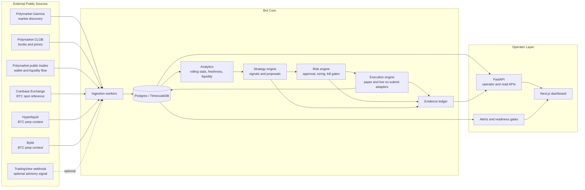
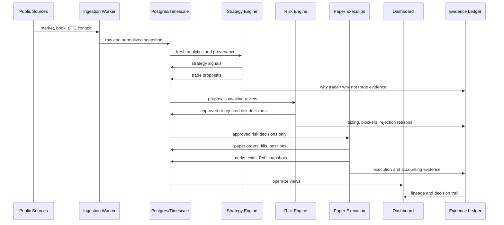
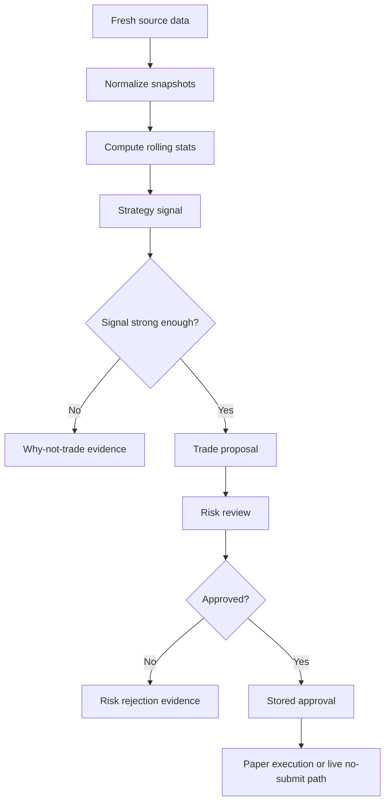
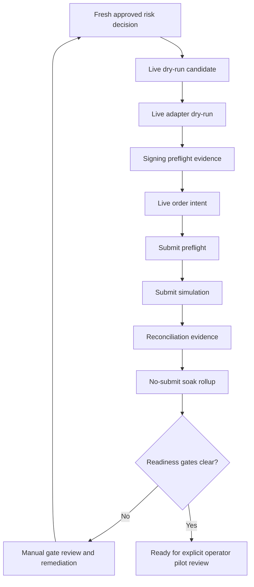
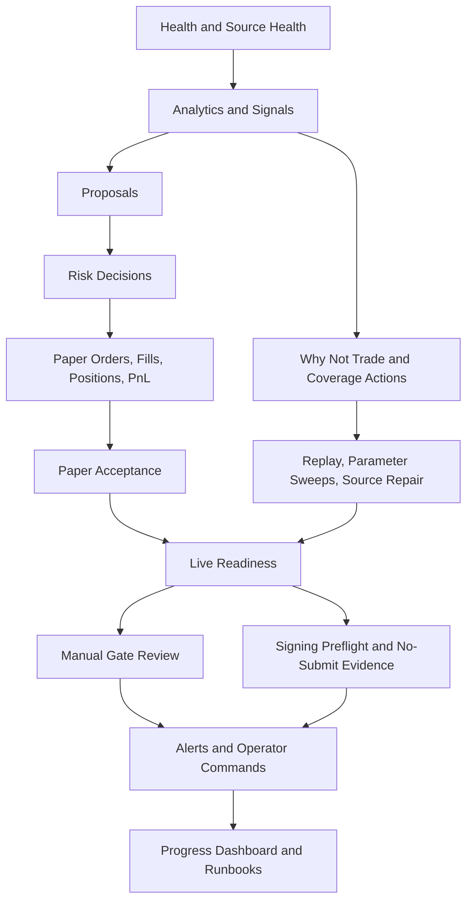
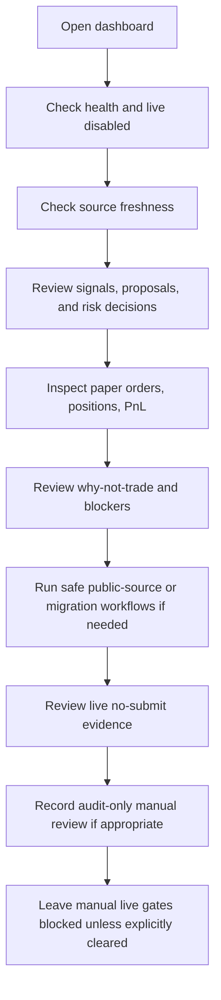

# First-Time Operator Guide

This guide explains how the prediction-market trading bot works from an
operator's point of view. It covers paper trading, the live no-submit readiness
path, the dashboard sections, external services, and the safety gates that must
stay intact before any real venue submission is considered.

The core rule is simple: strategies research and propose trades, the risk engine
approves or rejects them, and execution only acts on stored approvals. Live
venue submission remains disabled unless separate compliance, operator, wallet,
secret, risk, kill-switch, and paper-acceptance gates are explicitly cleared.

## System Map



## What Each Part Does

The ingestion workers collect public market and context data. Polymarket Gamma
discovers active markets, Polymarket CLOB supplies order books and prices,
Polymarket public trade data supports wallet-flow and liquidity-flow research,
Coinbase validates BTC spot price, and Hyperliquid plus Bybit provide perp
context. TradingView is optional and advisory only.

Postgres and TimescaleDB store normalized markets, order books, price ticks,
signals, proposals, risk decisions, paper orders, fills, positions, PnL,
operator commands, and evidence records. Redis supports local service
coordination.

Analytics turns stored snapshots into rolling statistics, z-scores, volatility,
liquidity checks, source freshness, confidence, and provenance status.

Strategies read analytics and source context. They produce signals and proposed
trades, but they cannot execute orders.

The risk engine owns approval. It checks stale data, source provenance,
liquidity, spread, exposure, allocation limits, drawdown gates, kill switches,
and sizing. Full Kelly is not allowed; fractional Kelly remains shadow or capped
according to configuration.

The execution engine handles paper orders, fills, positions, mark-to-market PnL,
close review, and live no-submit evidence. In the current safe build, live
adapter work creates dry-run, intent, signing preflight, submit-preflight,
simulation, reconciliation, and soak evidence with zero submitted orders.

The evidence ledger is the audit trail. It links data, signals, risk decisions,
orders, fills, PnL, blockers, operator actions, and readiness gates.

The FastAPI backend exposes read endpoints and operator actions. The dashboard
is the main operating surface.

## External Connections And Services

| Service | Used For | Safety Notes |
| --- | --- | --- |
| Polymarket Gamma | Market discovery, event metadata, active market list | Public data only in local v1 |
| Polymarket CLOB | Order books, token prices, midpoint/liquidity evidence | Public books/prices; live submission remains gated |
| Polymarket public trades | Reverse Snipe Strategy wallet-flow, late trade, and liquidity-flow evidence | Public observations only; never an automatic approval |
| Coinbase Exchange | Independent BTC spot reference | Used for BTC context validation |
| Hyperliquid | BTC perpetual context | Public context for momentum/funding/perp environment |
| Bybit | BTC perpetual context | Public context for cross-source comparison |
| TradingView | Optional advisory alerts/webhooks | Advisory only; cannot override risk gates |
| PostgreSQL / TimescaleDB | Persistent relational and time-series storage | Stores source, trading, PnL, and evidence records |
| Redis | Local coordination and queue support | No trading authority |
| Docker Compose | Local stack orchestration | Runs API, dashboard, database, Redis, ingestion, soak worker |
| FastAPI | Operator and read API | Exposes health, markets, proposals, risk, paper, live-readiness |
| Next.js Dashboard | Human operator interface | Main place to review, pause, inspect, and launch safe workflows |
| GitHub Actions | CI checks | Backend and dashboard checks before remote branch confidence |
| Prometheus / Grafana / Loki | Optional observability profile | Metrics, dashboards, and logs when available |

## First Start

Start the local stack:

```powershell
docker compose -f infra/docker/docker-compose.yml up --build -d postgres redis api dashboard
```

Open the dashboard:

```text
http://localhost:3000
```

Check the API:

```powershell
Invoke-RestMethod http://localhost:8000/health
```

Expected safety posture for local development:

```text
execution_mode = paper
live_trading_enabled = false
jurisdiction_gate_active = true
risk_engine_required = true
```

Run migrations when needed:

```powershell
docker compose -f infra/docker/docker-compose.yml --profile ingestion run --rm ingestion python -m ingestion_service.cli apply-migrations --dry-run
docker compose -f infra/docker/docker-compose.yml --profile ingestion run --rm ingestion python -m ingestion_service.cli apply-migrations
```

Run one bounded real public-source poll:

```powershell
docker compose -f infra/docker/docker-compose.yml --profile ingestion run --rm ingestion-poller python -m ingestion_service.cli poll-public-sources --cycles 1 --interval-seconds 1 --market-limit 5 --clob-token-limit 10 --coinbase-product-id BTC-USD --hyperliquid-coin BTC --bybit-symbol BTCUSDT
```

## Paper Trading Flow



### How To Use Paper Mode

1. Start the Docker stack.
2. Apply migrations.
3. Run public-source polling or leave the poller service running.
4. Watch Source Health for Polymarket, Coinbase, Hyperliquid, and Bybit.
5. Review Rolling Analytics and Strategy Signals.
6. Review Proposals and Risk Decisions.
7. Confirm only approved risk decisions reach paper execution.
8. Inspect Paper Orders, Fills, Positions, and PnL.
9. Use evidence and lineage drilldowns before trusting any result.
10. Use Paper Acceptance only after the operator is satisfied with behavior,
    coverage, and watch items.

Seed a deterministic paper path for a clean local smoke:

```powershell
docker compose -f infra/docker/docker-compose.yml --profile ingestion run --rm ingestion python -m ingestion_service.cli seed-paper-runtime --scenario all
```

Useful paper checks:

```powershell
Invoke-RestMethod http://localhost:8000/risk/decisions
Invoke-RestMethod http://localhost:8000/orders/paper
Invoke-RestMethod http://localhost:8000/positions
Invoke-RestMethod http://localhost:8000/pnl
Invoke-RestMethod http://localhost:8000/paper/runtime
Invoke-RestMethod http://localhost:8000/paper/acceptance-report
```

## How Trades Are Researched



The BTC strategy uses BTC spot/perp context, market momentum/reversal,
volatility, order-book imbalance, Polymarket implied probability, spread,
liquidity, source freshness, and time-to-resolution.

The mean-reversion strategy scans active markets for stretched moves, z-score,
velocity, liquidity, and catalyst risk. It proposes contrarian trades only when
movement is overextended and exit liquidity is adequate.

The Reverse Snipe Strategy (`reverse_sniping`) scans unresolved markets that
already trade at high implied probability late in their lifecycle. It looks for
fresh CLOB depth, tight spread, public late buying, repeat wallet behavior,
liquidity movement, and clear resolution rules. The goal is to test whether
many small high-probability paper wins still have edge after spread, slippage,
fees, and settlement risk.

Reverse sniping is paper/research-first. A wallet-flow signal is advisory
evidence only. The strategy should stay quarantined until replay and paper PnL
prove that the signal adds value beyond simply buying expensive likely winners.

The why-not-trade loop is important. Rejections and non-conversions are research
assets, not noise. They tell the operator whether the strategy correctly waited,
whether thresholds need calibration, or whether source coverage needs repair.

For reverse sniping, why-not-trade evidence is especially important. Common
valid waits include ambiguous market rules, stale CLOB data, thin ask depth,
wide spread, single-wallet flow, likely invalid/disputed resolution, or a price
so high that no edge remains.

## How Risk Is Defined

The risk engine is the final authority before execution. It checks:

- Source freshness and real-market-data provenance.
- Market liquidity, spread, and exit feasibility.
- Strategy, category, and portfolio exposure.
- Per-trade allocation caps.
- Drawdown halt rules.
- Kill-switch state.
- Operator and compliance gates for live readiness.
- Sizing mode and Kelly shadow audit fields.

Risk decisions persist approval status, rejection reasons, risk score, estimated
probability, market-implied probability, Kelly shadow size, and final approved
size. Execution adapters must read stored approvals; they cannot trust a raw
strategy signal.

## Paper Execution And Accounting

Paper execution converts approved risk decisions into simulated orders and fills.
It records the order, fill, position, mark-to-market PnL, close triggers, skipped
actions, and evidence links.

Paper positions can close through target, stop, time-stop, or close-review logic.
PnL panels expose realized and unrealized PnL plus lineage back to the source
data and risk decision.

## Live Trading Readiness Flow

The current live path is a no-submit readiness path. It exists to prove that the
bot can generate real-source candidates, construct live-looking payloads, run
preflight checks, simulate venue acknowledgement, reconcile state, and maintain a
soak window without submitting an exchange order.



Safety invariants:

```text
submitted_orders = 0
order_submission_enabled = false
live_order_submission = blocked or disabled
```

Paper mode and live no-submit mode share the same research and risk trail, but
they have different authority boundaries:

| Path | Purpose | Allowed Result | Not Allowed |
| --- | --- | --- | --- |
| Paper | Prove strategy, risk, accounting, PnL, and operator workflow behavior | Paper orders, fills, positions, closes, PnL, reflection | Venue account mutation |
| Live no-submit | Prove live-looking intent, signing preflight, submit preflight, simulation, reconciliation, and soak behavior | Audit evidence with zero submitted orders | Real venue submission |
| Live pilot | Controlled production validation after every gate is cleared | Small limit orders under supervision | Bypassing risk, compliance, operator, or kill-switch gates |

### Live No-Submit Operator Steps

1. Confirm paper acceptance report is ready.
2. Record paper reflection only after real operator acceptance.
3. Confirm source health and migrations are current.
4. Generate fresh real-source candidates through public-source polling.
5. Run live adapter dry-run only after fresh approved candidates exist.
6. Review signing preflight evidence.
7. Review live intent, submit preflight, simulation, and reconciliation history.
8. Keep the no-submit soak scheduler accumulating evidence.
9. Use Manual Gate Review to record reviewed-but-still-blocked state.
10. Do not clear compliance, jurisdiction, wallet, secrets, kill-switch, or
    operator confirmation gates unless the separate clearance workflow is truly
    completed.

Example dry-run command:

```powershell
Invoke-RestMethod -Method Post http://localhost:8000/operator/live-adapter/dry-run -ContentType "application/json" -Body '{"requested_by":"operator","note":"manual no-submit dry-run","venue":"polymarket","limit":5}'
```

Run one bounded no-submit soak cycle:

```powershell
docker compose -f infra/docker/docker-compose.yml --profile ingestion run --rm live-submit-soak-scheduler python -m ingestion_service.cli run-live-submit-simulation-soak-scheduler --cycles 1 --interval-seconds 0 --limit 5
```

## Dashboard Sections

| Section | What It Shows | How To Use It |
| --- | --- | --- |
| Source Health | Status, freshness, and confidence of external sources | Confirm data is fresh before trusting signals |
| Analytics | Rolling stats, volatility, z-score, liquidity, source confidence | Understand market context behind signals |
| Signals | Strategy observations before proposal conversion | Check why the bot is interested |
| Proposals | Candidate trades created from promoted strategies | Inspect conversion and source evidence |
| Risk Decisions | Approved/rejected proposals with sizing and reasons | Confirm risk approval before paper execution |
| Paper Orders/Fills | Paper order attempts and fill records | Verify execution path and idempotency |
| Positions/PnL | Open/closed positions, marks, realized/unrealized PnL | Monitor paper performance |
| Why Not Trade | Rejected or skipped opportunities | Turn repeated blockers into research work |
| Backtests/Replay | Deterministic and historical validation evidence | Validate strategy behavior before promotion |
| Paper Acceptance | Paper readiness report and operator reflection | Record acceptance only after review |
| Live Readiness | Dry-run, signing, manual gates, alerts, source/risk state | Keep live blocked until every gate is cleared |
| Manual Gate Review | Reviewed-but-still-blocked audit records | Document review without clearing gates |
| Alerts | Operational alerts, acknowledgement, suppression, resolution | Manage noise while preserving risk gates |
| Database Migrations | Migration and validation audit state | Confirm schema safety before operation |



For a first session, work left to right through the dashboard. If a later panel
looks blocked, return to the earlier panel named in the blocker. For example,
`source_health_attention` means review Source Health before trusting proposal
coverage, while `operator_paper_acceptance_reflection_missing` means review
Paper Acceptance before touching live readiness.

## Manual Gate Review

Manual Gate Review is audit-only. It helps the operator record that blockers were
reviewed, but it does not clear compliance, secrets, kill-switch, paper
reflection, or live submission gates.

A reviewed-but-still-blocked record is useful when a blocker has been inspected
but cannot or should not be cleared yet.

## Live Signing Preflight

Signing preflight evidence explains whether the bot can construct a no-submit
live order payload without exposing private material. It shows:

- whether payload construction is possible;
- whether a dedicated wallet address is present;
- whether live secrets are configured;
- whether secret material was loaded or logged;
- whether a payload hash exists, shown only as a redacted preview;
- whether signature payload hash evidence exists;
- which blockers must be repaired before rerunning no-submit dry-run.

The signing preflight panel must still show `submitted_orders=0`.

## Live Pilot Checklist

Actual live venue submission should not be considered until all of these are
true:

1. Legal and jurisdiction access has been confirmed.
2. Venue terms are attested.
3. Operator live confirmation is recorded.
4. Dedicated live wallet is configured.
5. Secrets are present through the approved secret-management path.
6. Kill switch is not active.
7. Source health and real-market-data provenance are current.
8. Migrations and validation audit are current.
9. Strategy replay and paper runtime evidence are current.
10. Paper acceptance reflection is accepted.
11. No-submit dry-run, signing preflight, intent, submit preflight, simulation,
    reconciliation, and soak evidence all pass.
12. The operator explicitly chooses to move from no-submit to a controlled pilot.

## Daily Operator Routine



## Common Operator Commands

```powershell
# Stack state
docker compose -f infra/docker/docker-compose.yml ps

# API health
Invoke-RestMethod http://localhost:8000/health

# Dashboard summary
Invoke-RestMethod http://localhost:8000/dashboard/summary

# Live readiness
Invoke-RestMethod http://localhost:8000/live/readiness

# Paper runtime
Invoke-RestMethod http://localhost:8000/paper/runtime

# Paper acceptance report
Invoke-RestMethod http://localhost:8000/paper/acceptance-report

# Live no-submit pilot acceptance report
Invoke-RestMethod http://localhost:8000/operator/live-order-submit-simulations/pilot-acceptance-report
```

## What Not To Do

- Do not put private keys or secrets in source control.
- Do not use a VPN or any geofence bypass.
- Do not treat paper acceptance as legal approval.
- Do not let a strategy bypass the risk engine.
- Do not let an LLM/catalyst note override numeric risk gates.
- Do not enable live submission because a dry-run passed.
- Do not clear kill-switch or compliance gates through Manual Gate Review.
- Do not use market orders in v1 live operation.

## Where To Read More

- [README.md](../../README.md)
- [Architecture Overview](../architecture/overview.md)
- [Operations Runbook](runbook.md)
- [Paper/Live System Runsheet](paper_live_system_runsheet.md)
- [User Perspective Guide](user-perspective-guide.md)
- [Risk Controls](../risk/controls.md)
- [Strategy Contract](../strategies/strategy-contract.md)
- [Progress Dashboard](../progress/progress_dashboard.html)
