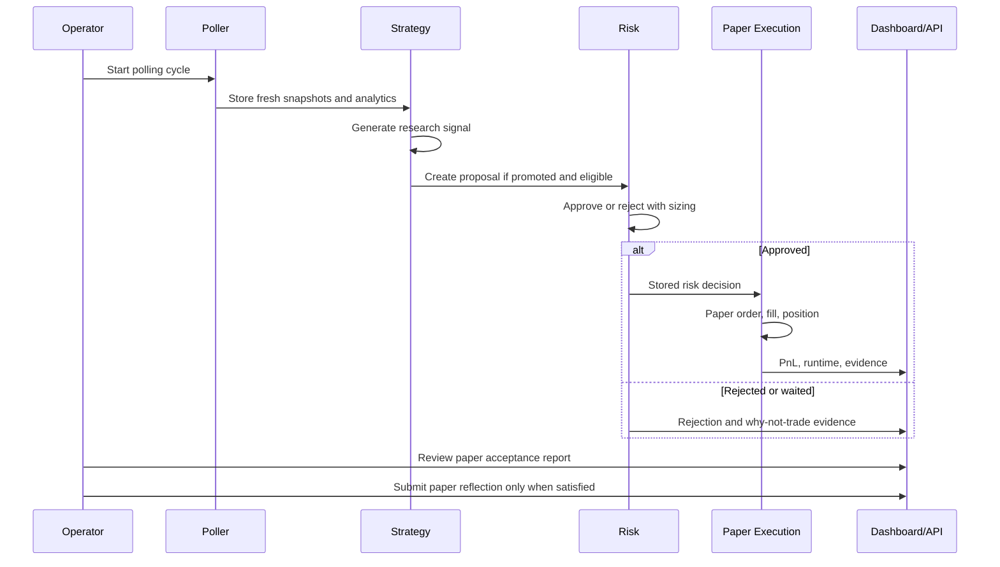
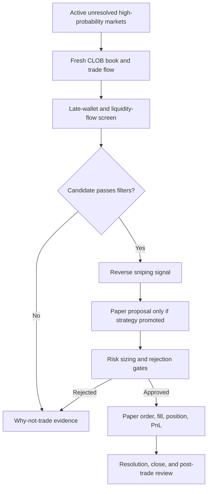
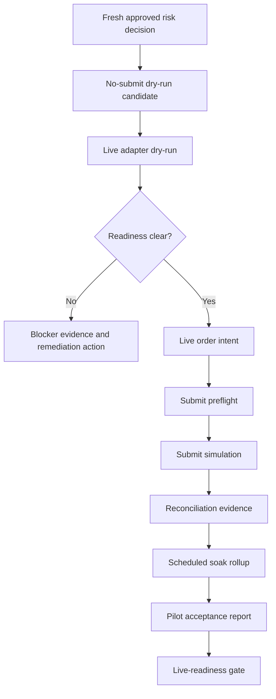
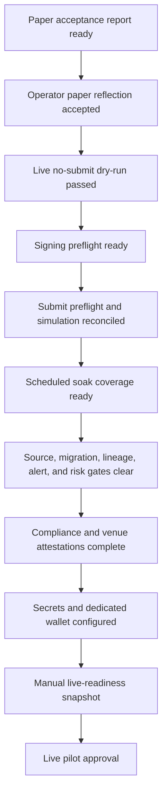

# Paper And Live System Runsheet

This runsheet is the operator-facing guide for accessing, using, and testing the
prediction trading bot in paper mode and in the gated live/no-submit path.

The system is intentionally risk-first:

- Strategies create signals and proposals.
- The risk engine approves or rejects stored proposals.
- Execution acts only on stored approvals.
- Paper execution is allowed for validation.
- Live order submission remains disabled until every compliance, operator,
  source, risk, and promotion gate is explicitly cleared.

Do not use a VPN, geofence bypass, or venue-access workaround. If legal access
to a venue is unclear, keep the system in paper/research mode.

## Quick Access

| Surface | URL / Command | Purpose |
| --- | --- | --- |
| Dashboard | `http://localhost:3000` | Main operator console |
| API | `http://localhost:8000` | API checks and operator actions |
| API health | `http://localhost:8000/health` | Runtime and safety status |
| Prometheus | `http://localhost:9090` | Metrics, optional observability profile |
| Grafana | `http://localhost:3001` | Dashboards, optional observability profile |
| Loki | `http://localhost:3100` | Logs, optional observability profile |
| Progress dashboard | `docs/progress/progress_dashboard.html` | Project status and remaining roadmap |

## Safety Modes

| Mode | What It Can Do | What It Must Not Do |
| --- | --- | --- |
| Research | Ingest public data, create signals, record why-not-trade evidence | Place paper or live orders |
| Paper | Convert approved proposals into paper orders/fills/positions/PnL | Submit orders to a venue |
| Live dry-run / no-submit | Build live-looking payloads, preflights, simulated acknowledgements, and soak evidence | Submit orders or mutate a venue account |
| Live | Submit real orders after all gates and legal approvals pass | Bypass risk, compliance, operator, or kill-switch controls |

The current local build should be treated as paper plus live no-submit. The live
adapter path is being hardened, but real order submission is still blocked by
default.

## System Map

```mermaid
flowchart LR
    subgraph Sources["Public Data Sources"]
        PMG["Polymarket Gamma"]
        CLOB["Polymarket CLOB"]
        PMT["Polymarket public trades and wallet flow"]
        CB["Coinbase BTC"]
        HL["Hyperliquid BTC"]
        BY["Bybit BTC"]
    end

    subgraph Core["Bot Core"]
        RAW["Raw events"]
        SNAP["Snapshots and ticks"]
        STATS["Rolling analytics"]
        SIG["Strategy signals"]
        RS["Reverse sniping candidate scan"]
        PROP["Trade proposals"]
        RISK["Risk decisions"]
    end

    subgraph Paper["Paper Trading"]
        PO["Paper order"]
        FILL["Fill"]
        POS["Position"]
        PNL["PnL and close review"]
        ACC["Paper acceptance report"]
        REF["Operator reflection"]
    end

    subgraph LiveDry["Live No-Submit Path"]
        DRY["Live dry-run candidate"]
        INTENT["Live intent"]
        PREF["Submit preflight"]
        SIM["Submit simulation"]
        SOAK["Scheduled soak rollup"]
        READY["Live readiness gate"]
    end

    Sources --> RAW --> SNAP --> STATS --> SIG
    SIG --> RS --> PROP
    SIG --> PROP
    PROP --> RISK
    RISK --> PO --> FILL --> POS --> PNL --> ACC --> REF
    RISK --> DRY --> INTENT --> PREF --> SIM --> SOAK --> READY
    REF --> READY
```



## 1. Start The Local Stack

Open PowerShell in the repository:

```powershell
cd "C:\Users\Kidsg\OneDrive\Documents\New project 4"
```

Start the core services:

```powershell
docker compose -f infra/docker/docker-compose.yml up --build -d postgres redis api dashboard
```

Start the continuous public-source poller when you want live public data to keep
refreshing:

```powershell
docker compose -f infra/docker/docker-compose.yml --profile ingestion up -d ingestion-poller
```

Start the scheduled no-submit soak worker when you want live dry-run evidence to
accumulate over time:

```powershell
docker compose -f infra/docker/docker-compose.yml --profile ingestion up -d live-submit-soak-scheduler
```

Optional observability services:

```powershell
docker compose -f infra/docker/docker-compose.yml --profile observability up --build -d
```

Check container health:

```powershell
docker compose -f infra/docker/docker-compose.yml ps
```

Follow logs:

```powershell
docker compose -f infra/docker/docker-compose.yml logs -f api dashboard ingestion-poller live-submit-soak-scheduler
```

Stop the stack:

```powershell
docker compose -f infra/docker/docker-compose.yml down
```

Use `down -v` only for disposable local resets because it removes the database
volume.

## 2. Confirm The Safety Baseline

Run:

```powershell
Invoke-RestMethod http://localhost:8000/health
```

Expected safety posture:

- `live_trading_enabled` is `false` unless a deliberately approved live
  deployment is being tested.
- Jurisdiction/compliance gates are active.
- API is reachable.
- Dashboard can load from `http://localhost:3000`.

Also check:

```powershell
Invoke-RestMethod http://localhost:8000/live/readiness
```

Expected local result for normal development:

- `status` is usually `blocked`.
- `live_order_submission` is `blocked`.
- Blockers explain exactly which gates are still closed.

Blocked live readiness is correct until the system has passed paper acceptance,
operator reflection, sustained no-submit soak, compliance, secrets, venue terms,
wallet, source-health, migration, alert, kill-switch, and pilot-readiness checks.

## 3. Maintain Database Migrations

Check migration state:

```powershell
docker compose -f infra/docker/docker-compose.yml --profile ingestion run --rm ingestion python -m ingestion_service.cli apply-migrations --dry-run
```

Apply pending migrations:

```powershell
docker compose -f infra/docker/docker-compose.yml --profile ingestion run --rm ingestion python -m ingestion_service.cli apply-migrations
```

For an old local Docker volume that already has tables but no migration ledger,
baseline once:

```powershell
docker compose -f infra/docker/docker-compose.yml --profile ingestion run --rm ingestion python -m ingestion_service.cli apply-migrations --baseline-existing
```

For live-readiness review, use the dashboard Database Migrations panel or the
safe API action:

```powershell
Invoke-RestMethod -Method Post http://localhost:8000/operator/database-migrations/validation/run-now -ContentType "application/json" -Body '{"requested_by":"operator","note":"manual migration validation before readiness review"}'
```

This action is read-only. It records audit evidence; it does not apply
migrations.

## 4. Run Real Public-Source Ingestion

For a bounded real-data cycle:

```powershell
docker compose -f infra/docker/docker-compose.yml --profile ingestion run --rm ingestion-poller python -m ingestion_service.cli poll-public-sources --cycles 1 --interval-seconds 1 --market-limit 5 --clob-token-limit 10 --coinbase-product-id BTC-USD --hyperliquid-coin BTC --bybit-symbol BTCUSDT
```

This does all of the following:

- Discovers active Polymarket markets.
- Discovers CLOB token ids from active outcomes.
- Ingests public CLOB books and prices.
- Ingests Coinbase BTC-USD spot context.
- Ingests Hyperliquid and Bybit BTC perp context.
- Computes rolling statistics.
- Generates research signals when thresholds are met.
- Converts promoted signals into proposals when eligible.
- Runs risk review.
- Executes approved decisions in paper mode.
- Marks and closes paper positions where evidence supports it.
- Generates operational alerts and evidence.
- Generates fresh no-submit live dry-run candidates when eligible.
- Processes queued no-submit soak requests when configured.

Confirm source and BTC context:

```powershell
Invoke-RestMethod http://localhost:8000/source-health
Invoke-RestMethod http://localhost:8000/prices/btc-context
```

Healthy polling can still produce zero proposals. That is not automatically a
failure. If signals do not clear strategy/risk thresholds, the correct behavior
is to record why-not-trade evidence instead of forcing a trade.

## 5. Paper Trading Workflow



### Paper dashboard checks

Open `http://localhost:3000` and inspect:

- Source Health
- BTC Context
- Signals
- Proposals
- Risk Decisions
- Paper Orders
- Fills
- Positions
- PnL
- Paper Runtime
- Replay/Research Evidence
- Paper Acceptance
- Paper Reflection
- Reverse Snipe Strategy / Late-Resolution Edge
- Why Not Trade / Signal Coverage
- Alerts and Operational Records
- Evidence drilldowns and timelines

### Paper API checks

```powershell
Invoke-RestMethod http://localhost:8000/signals
Invoke-RestMethod http://localhost:8000/proposals
Invoke-RestMethod http://localhost:8000/risk/decisions
Invoke-RestMethod http://localhost:8000/orders/paper
Invoke-RestMethod http://localhost:8000/fills
Invoke-RestMethod http://localhost:8000/positions
Invoke-RestMethod http://localhost:8000/pnl
Invoke-RestMethod http://localhost:8000/paper/runtime
Invoke-RestMethod "http://localhost:8000/paper/acceptance-report?limit=25"
Invoke-RestMethod "http://localhost:8000/operator/paper/acceptance-reflection-summary?limit=25"
```

### Reverse Snipe Strategy paper edge workflow

The Reverse Snipe Strategy is a late-resolution research edge. It looks for
unresolved Polymarket markets where the implied probability is already high,
public trade flow shows repeated late buying by profitable or high-conviction
wallets, and fresh liquidity is deep enough to enter and exit conservatively.
The edge is to test whether many small, high-probability paper wins can stack
after fees, spread, slippage, and settlement risk.

Treat reverse sniping as research/paper-only until it has its own historical
replay, paper PnL, source-freshness, liquidity, and operator acceptance evidence.
It must not bypass the normal proposal, risk, paper execution, live no-submit,
or live-readiness gates.



Candidate filters to review:

- Market is active, unresolved, and not paused, disputed, invalid, or already
  effectively settled.
- Implied probability is high enough for the strategy bucket being tested, for
  example `0.85` to `0.98`, without paying a price that leaves no residual edge.
- Resolution timing or public catalyst evidence supports a near-term outcome.
- CLOB source timestamp is fresh and not future-dated.
- Spread is tight enough for the configured bucket.
- Ask depth and safe exit liquidity are high enough for the proposed size.
- Recent public trade flow supports the same side without being a single thin
  print.
- Late-wallet activity is repeatable and publicly observable, but never treated
  as a guarantee.
- The candidate has no unresolved compliance, market-rules, oracle, or
  ambiguous-resolution concern.

Evidence to capture for each candidate:

- Market id, outcome id, question, category, close/resolution timing, and rules
  link.
- Current bid, ask, midpoint, spread, depth, safe exit liquidity, and freshness.
- Public wallet-flow summary: wallets observed, recent side, price, size,
  timestamp, and repeatability score.
- Market-implied probability versus estimated probability.
- Reason to trade, reason to wait, or reason to reject.
- Risk decision, approved size, rejection reasons, and Kelly shadow output.
- Paper order, fill, mark, close, realized/unrealized PnL, and settlement result.
- Post-trade reflection: whether the win came from genuine edge, stale pricing,
  lucky resolution timing, or a behavior that should be quarantined.

Suggested paper acceptance metrics:

- Candidate count and conversion rate from scan to signal to proposal.
- Hit rate by probability bucket, such as `85-90`, `90-95`, and `95-98`.
- Average paper return after modeled spread, slippage, and fees.
- Maximum adverse move before resolution.
- Liquidity evaporation rate after signal.
- False-positive rate from ambiguous or delayed resolution.
- Performance versus simple baselines: no-trade, high-probability random sample,
  wallet-flow-only, and liquidity-only.

Risk defaults for this edge should be stricter than broad mean reversion until
validated:

- No averaging down.
- Limit orders only.
- Smaller initial max allocation than normal paper strategies.
- Fresh CLOB and trade-flow provenance required.
- No proposal if the market has ambiguous resolution language.
- No proposal if liquidity is mostly from one side or one venue event.
- No live promotion until replay, paper PnL, and no-submit dry-run evidence are
  all current.

Current operator behavior:

- If the dedicated reverse-sniping dashboard panel is not available yet, use
  Signals, Why Not Trade / Signal Coverage, Proposals, Risk Decisions, Paper
  Orders, PnL, and Evidence drilldowns to inspect candidate lineage.
- Keep the strategy quarantined until the implementation has historical replay
  and paper evidence. A quarantined strategy may record research signals but
  must not create trade proposals.
- Promote `reverse_sniping` to paper proposal generation only after current
  replay/source evidence supports the promotion.

Quarantine the edge:

```powershell
Invoke-RestMethod -Method Post http://localhost:8000/operator/strategy/reverse_sniping/quarantine
```

Promote the edge to paper proposal generation only after review:

```powershell
Invoke-RestMethod -Method Post http://localhost:8000/operator/strategy/reverse_sniping/promote
```

### Seed deterministic paper evidence when needed

Use this only for local display/testing. It is not live-market proof:

```powershell
docker compose -f infra/docker/docker-compose.yml --profile ingestion run --rm ingestion python -m ingestion_service.cli seed-paper-runtime --scenario all
```

The deterministic seed proves UI/API wiring, paper accounting, skipped-action
diagnostics, and full signal-to-PnL lineage. Paper acceptance for promotion must
use historical/live replay-backed evidence, not only deterministic fixtures.

### Submit paper acceptance reflection

Only submit this after the paper acceptance report is ready and the operator has
reviewed the evidence.

```powershell
$body = @{
  decision = "accepted"
  reflected_by = "operator"
  reflection_notes = @(
    "Paper runtime and PnL evidence reviewed.",
    "Continue live dry-run soak with venue submission disabled."
  )
  watch_items = @(
    "Continue monitoring signal conversion and stale source blockers."
  )
  evidence_event_ids = @()
  evidence_references = @()
  confirm_paper_acceptance_reflection = $true
} | ConvertTo-Json -Depth 6

Invoke-RestMethod -Method Post http://localhost:8000/operator/paper/acceptance-reflection -ContentType "application/json" -Body $body
```

The reflection is audit-only. It does not enable live trading and records:

- `live_order_submission=disabled`
- `paper_research_only=true`
- `submitted_orders=0`
- Operator command history
- Evidence ledger record
- Timeline drilldown

## 6. Live No-Submit Workflow

The live path currently exists to prove that the system can build, preflight,
simulate, reconcile, and soak live-looking orders without submitting anything.



Run a no-submit live adapter dry-run:

```powershell
Invoke-RestMethod -Method Post http://localhost:8000/operator/live-adapter/dry-run -ContentType "application/json" -Body '{"requested_by":"operator","note":"manual no-submit dry-run","venue":"polymarket","limit":5}'
```

Review history:

```powershell
Invoke-RestMethod "http://localhost:8000/operator/live-adapter/dry-runs?limit=25"
Invoke-RestMethod "http://localhost:8000/operator/live-adapter/dry-run-candidates?limit=25"
Invoke-RestMethod "http://localhost:8000/operator/live-adapter/dry-run-blockers?limit=25"
Invoke-RestMethod "http://localhost:8000/operator/live-adapter/dry-run-remediation-rollups?limit=25"
```

The no-submit invariant is:

- `order_submission_enabled=false`
- `submitted_orders=0`
- No venue account mutation
- No real order id
- Every blocked path writes evidence

## 7. Live Intent, Preflight, Simulation, And Soak

The dashboard has operator buttons for these steps. Use the API examples when
you need a direct smoke check.

Create a live intent from approved dry-run context:

```powershell
Invoke-RestMethod -Method Post http://localhost:8000/operator/live-orders/intent -ContentType "application/json" -Body '{"requested_by":"operator","note":"manual no-submit intent","confirm_intent":true}'
```

Run guarded submit preflight:

```powershell
Invoke-RestMethod -Method Post http://localhost:8000/operator/live-orders/submit-preflight -ContentType "application/json" -Body '{"requested_by":"operator","note":"manual guarded submit preflight","confirm_submit_preflight":true}'
```

Run controlled submit simulation:

```powershell
Invoke-RestMethod -Method Post http://localhost:8000/operator/live-orders/submit-simulation -ContentType "application/json" -Body '{"requested_by":"operator","note":"manual controlled submit simulation","confirm_submit_simulation":true}'
```

Queue a no-submit soak run:

```powershell
Invoke-RestMethod -Method Post http://localhost:8000/operator/live-orders/submit-simulation/soak/run-now -ContentType "application/json" -Body '{"requested_by":"operator","note":"manual no-submit soak","limit":5,"min_drill_count":3,"min_soak_hours":24,"min_unique_orders":2}'
```

Process queued soak requests once:

```powershell
docker compose -f infra/docker/docker-compose.yml --profile ingestion run --rm live-submit-soak-scheduler python -m ingestion_service.cli process-live-submit-simulation-soak --limit 5
```

Run one bounded scheduler cycle:

```powershell
docker compose -f infra/docker/docker-compose.yml --profile ingestion run --rm live-submit-soak-scheduler python -m ingestion_service.cli run-live-submit-simulation-soak-scheduler --cycles 1 --interval-seconds 0 --limit 5
```

Review live no-submit reports:

```powershell
Invoke-RestMethod "http://localhost:8000/operator/live-orders/intents?limit=25"
Invoke-RestMethod "http://localhost:8000/operator/live-orders/submit-preflights?limit=25"
Invoke-RestMethod "http://localhost:8000/operator/live-orders/submit-simulations?limit=25"
Invoke-RestMethod "http://localhost:8000/operator/live-orders/submit-simulation/soak-runs?limit=25"
Invoke-RestMethod "http://localhost:8000/operator/live-orders/submit-simulation/drill-report?limit=25&min_drill_count=3&min_soak_hours=24&min_unique_orders=2"
Invoke-RestMethod "http://localhost:8000/operator/live-orders/submit-simulation/acceptance-report?limit=25&min_drill_count=3&min_soak_hours=24&min_unique_orders=2"
```

The 24-hour soak gate requires real elapsed time. Deterministic fixtures may be
visible for diagnostics, but they should not be counted as real pilot evidence.

## 8. Live Promotion Gate Checklist



Before any real live order submission, verify all of this:

- `EXECUTION_MODE=live` is deliberate and reviewed.
- `ENABLE_LIVE_TRADING=true` is deliberate and reviewed.
- Jurisdiction and venue-access attestation is current.
- Venue terms are reviewed.
- A dedicated limited-risk wallet or account is configured.
- Live credentials are loaded from secrets, not source control.
- The operator has explicitly confirmed live mode.
- Kill switch is inactive.
- No unresolved critical/high alerts.
- No active critical/high alert suppressions masking live-readiness risk.
- Database migrations are current and validation audit is fresh.
- Required real public market-data sources are healthy.
- Paper runtime has real history and current accounting.
- Paper acceptance report is ready.
- Operator paper acceptance reflection is accepted.
- Reverse sniping, if enabled, has its own replay-backed paper acceptance
  evidence and is not relying only on observed wallet behavior.
- Live adapter dry-run has passed.
- Signing preflight evidence is present and no-submit.
- Submit preflight and simulation are reconciled and no-submit.
- Scheduled soak report has enough elapsed time and unique-order coverage.
- No recurring dry-run remediation action blocks promotion.
- Scoped lineage links are complete/current.
- Position, strategy, category, daily drawdown, and weekly drawdown limits are
  conservative.

## 9. Emergency And Maintenance Actions

Pause all trading:

```powershell
Invoke-RestMethod -Method Post http://localhost:8000/operator/pause
```

Activate kill switch:

```powershell
Invoke-RestMethod -Method Post http://localhost:8000/operator/kill-switch
```

Quarantine a strategy:

```powershell
Invoke-RestMethod -Method Post http://localhost:8000/operator/strategy/mean_reversion/quarantine
```

Promote a strategy to paper proposal generation after evidence is current:

```powershell
Invoke-RestMethod -Method Post http://localhost:8000/operator/strategy/mean_reversion/promote
```

Inspect alerts:

```powershell
Invoke-RestMethod "http://localhost:8000/alerts?resolved=false"
Invoke-RestMethod "http://localhost:8000/alerts/history?limit=50"
```

Acknowledge an alert after review:

```powershell
Invoke-RestMethod -Method Post http://localhost:8000/alerts/<alert-id>/acknowledge -ContentType "application/json" -Body '{"acknowledged_by":"operator","note":"reviewed in dashboard"}'
```

Resolve only after the condition has cleared:

```powershell
Invoke-RestMethod -Method Post http://localhost:8000/alerts/<alert-id>/resolve -ContentType "application/json" -Body '{"resolved_by":"operator","note":"condition cleared"}'
```

Suppress recurring migration-validation alerts during a maintenance window:

```powershell
Invoke-RestMethod -Method Post http://localhost:8000/alerts/<alert-id>/suppress -ContentType "application/json" -Body '{"suppressed_by":"operator","note":"planned maintenance","expires_in_seconds":3600}'
```

## 10. Testing Checklist

### Backend unit and simulation tests

```powershell
python -m pytest tests/unit/test_api_observability.py
python -m pytest tests/unit/test_operator_api.py
python -m pytest tests/simulation/test_deterministic_paper_path.py
```

Full backend checks:

```powershell
python -m pytest
ruff check .
mypy packages services apps
```

### Dashboard checks

```powershell
npm --prefix apps/dashboard run typecheck
npm --prefix apps/dashboard run build
```

Run end-to-end checks when the stack is up:

```powershell
npm --prefix apps/dashboard run e2e
```

### Container smoke checks

```powershell
docker compose -f infra/docker/docker-compose.yml up --build -d postgres redis api dashboard
Invoke-RestMethod http://localhost:8000/health
Invoke-RestMethod http://localhost:8000/dashboard/summary
Invoke-RestMethod http://localhost:8000/live/readiness
```

### Paper-path smoke checks

```powershell
Invoke-RestMethod http://localhost:8000/paper/runtime
Invoke-RestMethod "http://localhost:8000/paper/acceptance-report?limit=25"
Invoke-RestMethod "http://localhost:8000/operator/paper/acceptance-reflection-summary?limit=25"
```

### Live no-submit smoke checks

```powershell
Invoke-RestMethod -Method Post http://localhost:8000/operator/live-adapter/dry-run -ContentType "application/json" -Body '{"requested_by":"operator","note":"smoke no-submit dry-run","venue":"polymarket","limit":5}'
Invoke-RestMethod "http://localhost:8000/operator/live-orders/submit-simulation/acceptance-report?limit=25&min_drill_count=3&min_soak_hours=24&min_unique_orders=2"
```

Expected live no-submit result:

- Dry-run may pass or block depending on current gates and candidates.
- `submitted_orders` remains `0`.
- `order_submission_enabled` remains `false`.
- Any blocker appears in readiness, evidence, remediation, and dashboard
  history.

## 11. Daily Operator Routine

```mermaid
flowchart LR
    A["Start stack"] --> B["Check health"]
    B --> C["Run or confirm poller"]
    C --> D["Review source health"]
    D --> E["Review signals and proposals"]
    E --> F["Review paper orders, PnL, and alerts"]
    F --> G["Review why-not-trade coverage"]
    G --> H["Check paper acceptance/reflection"]
    H --> I["Check live no-submit readiness"]
    I --> J["Record notes, resolve cleared alerts, leave blockers visible"]
```



Start of session:

- Confirm Docker is running.
- Confirm API and dashboard load.
- Confirm live trading is disabled unless deliberately testing approved live
  deployment gates.
- Confirm source health is current.
- Confirm migrations and migration validation are current.
- Confirm unresolved alerts are understood.

During session:

- Watch source health, BTC context, signals, proposals, rejections, paper
  orders, fills, positions, PnL, and alerts.
- Treat no-proposal cycles as valid when rejection reasons explain the wait.
- For reverse sniping, review high-probability unresolved candidates, wallet-flow
  evidence, liquidity depth, spread, and resolution ambiguity before accepting
  any paper result as useful evidence.
- Use remediation/action item panels for recurring blockers.
- Keep no-submit live soak running only while public data and source health are
  current.

End of session:

- Review filled and skipped paper actions.
- Review PnL and close events.
- Review why-not-trade and signal-coverage blockers.
- Record operator notes or reflection when evidence is ready.
- Resolve alerts only after evidence proves the condition cleared.
- Leave unresolved risk/compliance/source blockers visible.

## 12. Troubleshooting

| Symptom | First Checks | Likely Action |
| --- | --- | --- |
| Dashboard does not load | `docker compose ps`, dashboard logs, API logs | Rebuild `api` and `dashboard` |
| API health fails | API logs, Postgres health, Redis health | Restart API after database is healthy |
| Migrations blocked | Migration panel, dry-run output | Apply pending migration or repair checksum drift only after review |
| No signals | Source health, rolling stats, thresholds | Often valid; inspect signal coverage and why-not-trade |
| Signals but no proposals | Promotion status, replay freshness, proposal-review blockers | Use coverage report and lifecycle actions |
| Reverse sniping candidates look good but do not propose | Strategy quarantine, missing trade-flow evidence, spread/liquidity filters, ambiguous resolution | Keep research-only and inspect why-not-trade evidence |
| Proposals but no paper orders | Risk decisions, approval size, duplicate proposal id | Inspect risk and paper order lineage |
| Paper runtime attention | Missing midpoint, stale mark, open positions | Run poller/accounting and inspect skipped actions |
| Live readiness blocked | `/live/readiness` blockers | Clear blockers one by one; do not bypass |
| Soak report not ready | Elapsed time, unique-order count, no-mutation count | Keep real scheduled no-submit worker running |
| Alert noise during maintenance | Alert history and suppression expiry | Use timed suppression with a clear note |

## 13. What Counts As Done

Paper-ready means:

- Real public-source ingestion works.
- Strategy signals are explainable.
- Proposal conversion and risk review are conservative.
- Reverse sniping candidates, if enabled, have replay-backed and paper-backed
  proof that late-wallet/liquidity-flow evidence adds edge after spread,
  slippage, and settlement risk.
- Paper orders, fills, positions, marks, closes, and PnL are persisted.
- Paper acceptance report is ready from historical/live replay-backed evidence.
- Operator paper reflection is recorded and accepted.
- Alerts, lineage, and evidence are inspectable.

Live-ready pilot means:

- Paper-ready is complete.
- Legal/venue access is approved.
- Live credentials and dedicated wallet are configured safely.
- No-submit dry-run, intent, preflight, simulation, reconciliation, and soak
  reports are ready.
- Live-readiness gate has no blockers.
- Operator signs a live-readiness snapshot.
- Initial live pilot limits are conservative and manually supervised.

Until then, the correct operating state is paper plus live no-submit evidence.
