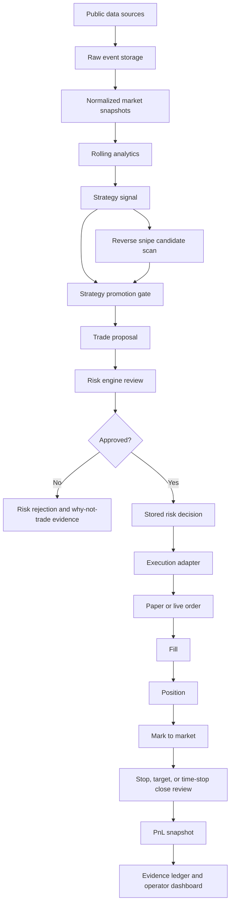

# Prediction Trading Bot User Perspective Guide

This guide explains how the bot is intended to work for an operator: how to run
it in paper mode, what must happen before live trading, how to interact with it
during trading, and what technical pieces support the workflow.

## Operating Model

The bot is designed as a risk-first trading system. Strategies can discover and
score opportunities, but they do not place trades directly. Every trade must
move through a stored proposal, a stored risk decision, and an execution adapter
that refuses to act unless the approval is present and current.

The normal operator workflow is:

1. Start the local stack.
2. Run public-source ingestion or the scheduled poller.
3. Review source health, analytics, signals, proposals, rejections, positions,
   PnL, alerts, and evidence in the dashboard.
4. Promote only strategies with current replay, parameter-sweep, and
   walk-forward evidence.
5. Let approved proposals execute in paper mode.
6. Review fills, positions, PnL, skipped actions, and "why not trade" evidence.
7. Keep live trading disabled until compliance, secrets, risk health, operator
   controls, and paper performance gates are all satisfied.

The main strategy edges are BTC short-timeframe, mean reversion, and the
Reverse Snipe Strategy. Reverse sniping looks for unresolved high-probability
markets late in their lifecycle where fresh liquidity, public trade flow, and
repeat wallet behavior suggest a small paper edge may remain after spread,
slippage, fees, and settlement risk.

## Paper Trading Setup

Paper mode is the default and safest operating mode.

1. Install Docker Desktop and confirm Docker is running.
2. Copy `.env.example` to `.env` if environment overrides are needed.
3. Confirm live trading remains disabled:

```powershell
ENABLE_LIVE_TRADING=false
```

4. Start the core stack:

```powershell
docker compose -f infra/docker/docker-compose.yml up --build -d postgres redis api dashboard
```

5. Open:

- API: `http://localhost:8000`
- Dashboard: `http://localhost:3000`

6. Run a bounded public-source polling cycle:

```powershell
docker compose -f infra/docker/docker-compose.yml --profile ingestion run --rm ingestion-poller python -m ingestion_service.cli poll-public-sources --cycles 1 --interval-seconds 1 --market-limit 5 --clob-token-limit 10 --coinbase-product-id BTC-USD --hyperliquid-coin BTC --bybit-symbol BTCUSDT
```

7. If current markets do not naturally create a qualifying signal, seed the
   deterministic paper runtime fixture to verify the full display path:

```powershell
docker compose -f infra/docker/docker-compose.yml --profile ingestion run --rm ingestion python -m ingestion_service.cli seed-paper-runtime --scenario all
```

## Paper Trading Operation

The operator mainly works from the dashboard.

Use the dashboard to inspect:

- Source health: whether market and BTC context data is fresh enough to trust.
- Analytics: rolling means, z-scores, volatility, spreads, and liquidity.
- Signals: research opportunities generated by strategy logic.
- Reverse Snipe Strategy candidates: high-probability unresolved markets with
  late public trade/wallet-flow evidence, liquidity depth, spread, and
  resolution-ambiguity checks.
- Proposals: signals converted into proposed paper trades.
- Risk decisions: approvals, rejections, sizing, and Kelly shadow values.
- Paper orders and fills: what the paper adapter attempted and filled.
- Positions and PnL: open exposure, realized PnL, unrealized PnL, and close
  events.
- Alerts: unresolved or unacknowledged operational conditions.
- Evidence: the audit trail behind every signal, approval, rejection, order,
  fill, position, mark, close, and operator action.

Useful operator actions:

- Pause trading when data quality or risk state is unclear.
- Activate the kill switch during abnormal behavior.
- Quarantine strategies that are stale, degraded, or not ready.
- Promote strategies only after deterministic replay and research evidence are
  current.
- Acknowledge alerts after review.
- Resolve alerts only after the condition has cleared or the remediation is
  documented.
- Use "why not trade" views to turn rejected opportunities into research
  backlog items.
- For reverse sniping, treat rejected candidates as useful evidence. They show
  whether the bot correctly waited because of stale books, thin depth, wide
  spreads, ambiguous rules, single-wallet flow, or insufficient residual edge.

### Reverse Snipe Strategy operation

In paper mode, reverse sniping should be operated as a research edge:

1. Keep `reverse_sniping` quarantined while gathering initial evidence.
2. Review high-probability unresolved markets and confirm the rules are clear.
3. Inspect CLOB bid/ask/midpoint, spread, ask depth, and safe exit liquidity.
4. Inspect public late trade flow and repeat wallet behavior.
5. Compare estimated probability with market-implied probability.
6. Let the risk engine approve, reject, or size any promoted paper proposal.
7. Review paper fills, mark-to-market movement, close/settlement result, and
   PnL before considering the edge validated.

Do not treat wallet behavior as proof. It is one input into the evidence ledger,
not permission to trade.

## Live Trading Setup

Live trading is the end goal, but it must remain gated until the system proves
paper behavior and compliance readiness. It is not a switch to flip casually.

Before live trading can be enabled, all of these must be true:

- The operator has confirmed legal access for the target venue and jurisdiction.
- No VPN, geofence bypass, or restricted-access workaround is being used.
- `ENABLE_LIVE_TRADING=true` is explicitly set.
- Required trading secrets are present in `.env` or the production secret
  manager.
- A dedicated trading wallet or exchange subaccount is configured.
- The strategy is promoted and not quarantined.
- Any reverse-sniping live candidate has replay-backed and paper-backed evidence
  proving the edge after spread, slippage, fees, and settlement risk.
- Replay validation is current and passed.
- Parameter-sweep and walk-forward research evidence is current and attested.
- Source health is acceptable.
- Risk health is acceptable.
- Kill switch is not active.
- Operator confirmation is present for live mode.
- Position, strategy, category, daily drawdown, and weekly drawdown limits are
  configured conservatively.

Live mode should start with the smallest allowed size, limit orders only, and
manual supervision. Early live trading should be treated as production
validation, not profit maximization.

Before any live order path is promoted, run the no-submit live adapter dry-run.
It selects a persisted, risk-approved proposal, builds the limit order payload
that the live adapter would submit, records the operator audit command, and
forces `submitted_orders=0`. The dry-run may clear the circular
`live_adapter_dry_run_missing` readiness blocker, but any other live readiness
blocker still prevents the dry-run from passing.

```powershell
Invoke-RestMethod -Method Post http://localhost:8000/operator/live-adapter/dry-run -ContentType "application/json" -Body '{"requested_by":"operator","note":"manual no-submit dry-run","venue":"polymarket","limit":5}'
```

## Live Trading Operation

In live mode, the operator should monitor the same views as paper mode plus:

- Live-order state and rejected live-order attempts.
- Venue connectivity and authentication health.
- Fill quality, slippage, and stale order handling.
- Wallet or exchange account exposure.
- Live PnL versus the shadow paper portfolio.
- Compliance and jurisdiction gate status.

Operational rules:

- Do not average down.
- Do not allow market orders in v1 live operation.
- Do not let LLM or catalyst analysis override numeric risk gates.
- Keep fractional Kelly in shadow mode until paper results justify promotion.
- Stop live trading immediately if source freshness, order routing, accounting,
  or alerting becomes unreliable.

## Data Flow



The important control point is the risk decision. Execution only acts on stored
approvals, and every later stage writes evidence for audit and reflection.

## Technical Summary

Core stack:

- Python 3.13 services
- FastAPI backend
- Pydantic v2 shared contracts
- SQLAlchemy/Alembic-style schema management through migration SQL validation
- PostgreSQL with TimescaleDB extension for time-series tables
- Redis for service coordination
- Next.js, TypeScript, Tailwind-style CSS, lucide icons, and Recharts dashboard
- Docker Compose for local orchestration
- GitHub Actions CI for backend and dashboard checks

Main services:

- Ingestion service: Polymarket Gamma, Polymarket CLOB, Coinbase BTC spot,
  Polymarket public trade/wallet-flow observations, Hyperliquid BTC perp,
  Bybit BTC perp, and scheduled polling.
- Analytics package: rolling statistics, z-scores, velocity, volatility, spread,
  liquidity, and freshness/confidence scoring.
- Strategy engine: research signals and proposal conversion for promoted
  strategies, including BTC short-timeframe, mean reversion, and reverse
  sniping.
- Risk engine: sizing, rejection reasons, drawdown checks, exposure controls,
  and Kelly shadow audit values.
- Execution engine: paper order, fill, position, mark-to-market, and close
  review logic; live adapter remains gated.
- API: read and operator endpoints for dashboard and automation.
- Dashboard: operator view into health, evidence, proposals, risk, paper
  accounting, alerts, and intervention controls.

Storage:

- Raw events preserve source payloads for audit and replay.
- Market snapshots, order-book snapshots, price ticks, rolling stats, PnL
  snapshots, and portfolio snapshots are time-series oriented.
- Strategy signals, proposals, risk decisions, paper orders, fills, positions,
  alerts, operator commands, and evidence events are relational audit records.
- Evidence links connect trading lifecycle objects so the operator can inspect
  lineage from a row or timeline.

## Operator Confidence Path

The path to live trading should be staged:

1. Public ingestion is stable.
2. Signals are explainable.
3. Risk rejections are understandable.
4. Paper proposals are generated only from promoted strategies.
5. Paper orders execute only from stored approvals.
6. Paper fills, positions, marks, closes, and PnL are deterministic under test.
7. Alerts and kill switches behave predictably.
8. Evidence lineage is complete and repairable.
9. Paper performance is stable across market regimes.
10. Reverse sniping, if enabled, has separate replay, paper PnL, and
    wallet/liquidity-flow evidence showing it is not just buying expensive
    likely winners.
11. Live adapter is enabled only after legal, operational, and risk gates are
    satisfied.

## Daily Operator Checklist

Before running:

- Docker stack is healthy.
- Source health is current.
- Replay validation is current and passed.
- Research evidence is current and attested.
- No unresolved critical alerts.
- Kill switch is clear.
- Strategies intended for paper execution are promoted.

During running:

- Watch source health, proposals, rejections, orders, fills, positions, PnL,
  drawdown, and alerts.
- Pause or quarantine on stale data, unexpected fills, missing marks, or
  unexplained PnL movement.
- Review rejected trades for recurring false negatives or useful tuning
  candidates.

After running:

- Review filled and skipped actions.
- Compare paper PnL with no-trade and shadow sizing baselines.
- Review evidence ledger entries for material trades.
- Resolve alerts only when the underlying condition is cleared.
- Record lessons in the research backlog.
